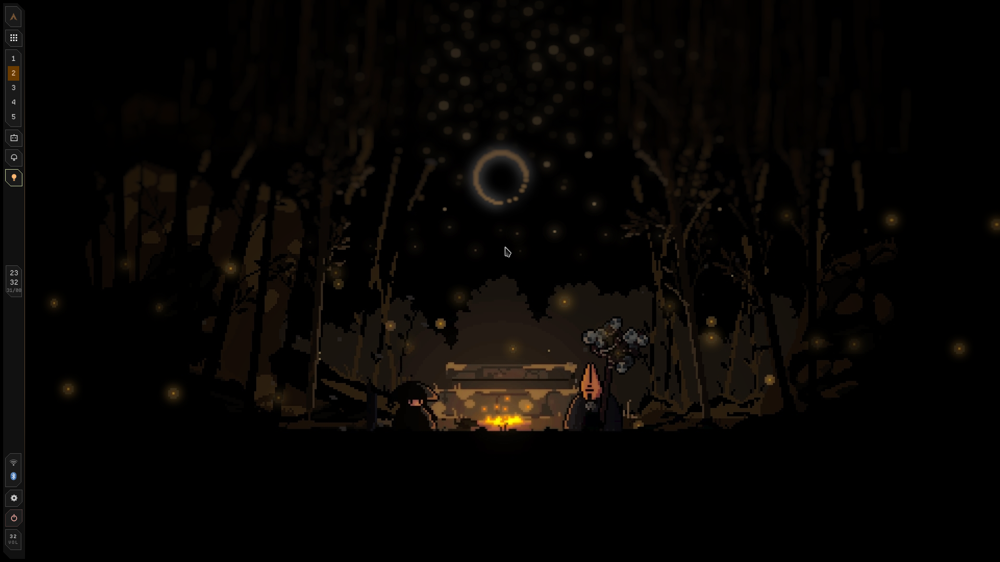

<div align="center">

# crux



<h4>My own Hyprland shell, written from scratch instead of forking one.</h4>


 <br>


</div>

> [!WARNING]
> This is my personal daily driver. It changes under me without warning, and every corner gets chamfered whether you like it or not.

> [!TIP]
> Everything's configurable from the settings panel — search box included, because 21 tabs is a lot to remember.

## What it does

Bar, lock screen, notifications, OSD, Control Center, launcher, clipboard
history. Pick a wallpaper and it'll pull colors out of it and push them
into Hyprland, kitty, GTK, Qt, yazi, btop, starship, and Discord.

## Dependencies

[Hyprland](https://hyprland.org), [Quickshell](https://quickshell.org),
and `matugen`, `brightnessctl`, `wlsunset`, `cliphist`, `wl-clipboard`,
`playerctl`, `networkmanager`, `bluez`.

## Plugins

Drop a `manifest.json` + `Widget.qml` in `~/.config/crux/plugins/<name>/`.
That's it, no marketplace.

## Install

**Arch (AUR):**

```
yay -S crux-shell-git
qs -c crux
```

**Manual:**

```
git clone https://github.com/teezlabs/crux-shell ~/.config/quickshell/crux
qs -c crux
```

Launch it at login:

```lua
hl.on("hyprland.start", function()
    hl.exec_cmd("qs -c crux")
end)
```

<div align="center">

<sub>made with ~~Claude~~ love</sub>

</div>
